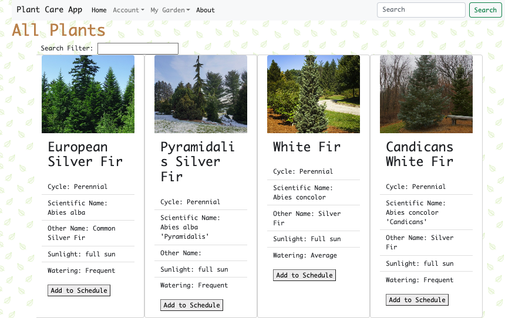

# Plant Care App



Plant Care App is an application designed to help plant enthusiasts manage their plant collection by learning about new plants, and keeping track of their plant watering schedules. With this app, users can easily organize their plant schedules and access a database of plant information.

## Table of contents

- [General features](#general-info)
- [Technologies](#technologies)
- [Setup](#setup)
- [Usage](#usage)
- [Roadmap](#roadmap)
- [Credits](#credits)

## General features

The Plant Care App offers the following features:

- User Signup and Login: User authentication to create a personalized account.
- Plant library: a database of plants with information on the specific plant, photos, care requirements such as sunlight, and frequency of watering.
- Plant tracker: Users can save a plant and track their watering care routines.

## Technologies

This Plant Care App is created with:

- Ruby on Rails: A server-side web application framework written in Ruby under the MIT License.
- React.js: An open-source Javascript Framework and library for building web applications.
- Bootstrap: A free and open-source CSS framework directed at responsive, mobile-first front-end web development.
- Plant API: A third-party API for accessing plant care information. The API site I used was [Perenual](https://perenual.com/docs/api).
  - Environment Variable for API key security.

## Setup

To run this project, follow these steps:

1. Clone the repository: git clone https://github.com/anniejhwang/PlantCareAppFrontend.git
2. install dependencies:

```bash
npm install
```

## Usage

```bash
npm run dev
```

Hurray! We just set up the frontend of our Plant Care App! If you haven't already, you can set up the backend, by following this link: [PlantCareApp (backend)](https://github.com/anniejhwang/PlantCareApp).

You'll need to have the backend code running on http://localhost:3000.
You can view the app on http://localhost:5173.

## Roadmap

- Plant library: Enhance the plant library to incorporate specific growing tips, more photos, and common plant diseases or illnesses.
- Plant tracker: Enhance the plant tracker so that it can also track fertilizing and or pruning.
- Reminders: Allow users to set reminders for watering, fertilizing, repotting, and or other care tasks to ensure their plants stay healthy.
- Community: Allow users to connect with other plant parents where they can share tips, photos, or advice.
- Third Party API: Currently the API I used will only allow one plant to be searched at a time as well as only making 300 API requests a day. I would want to find a way to allow the users to make as many requests as they can to ensure the best user experience.

## Credits

The Plant Care App was developed by Annie Hwang. The app uses data from the Perenual and was a capstone project for Actualize Coding Bootcamp.
